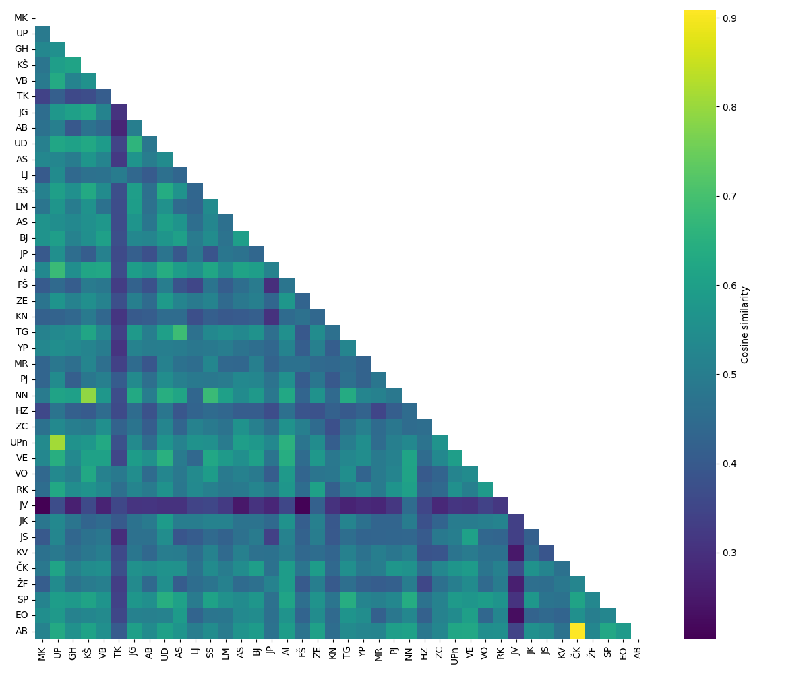
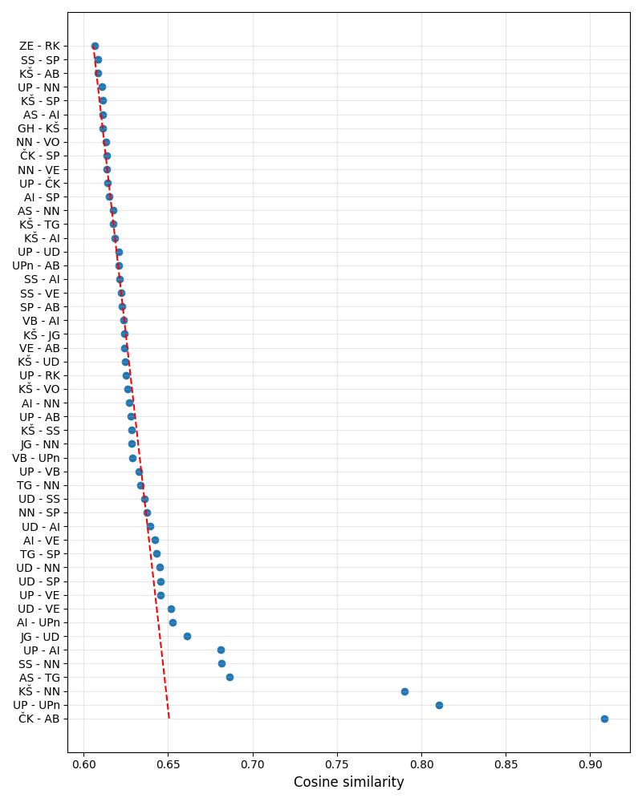
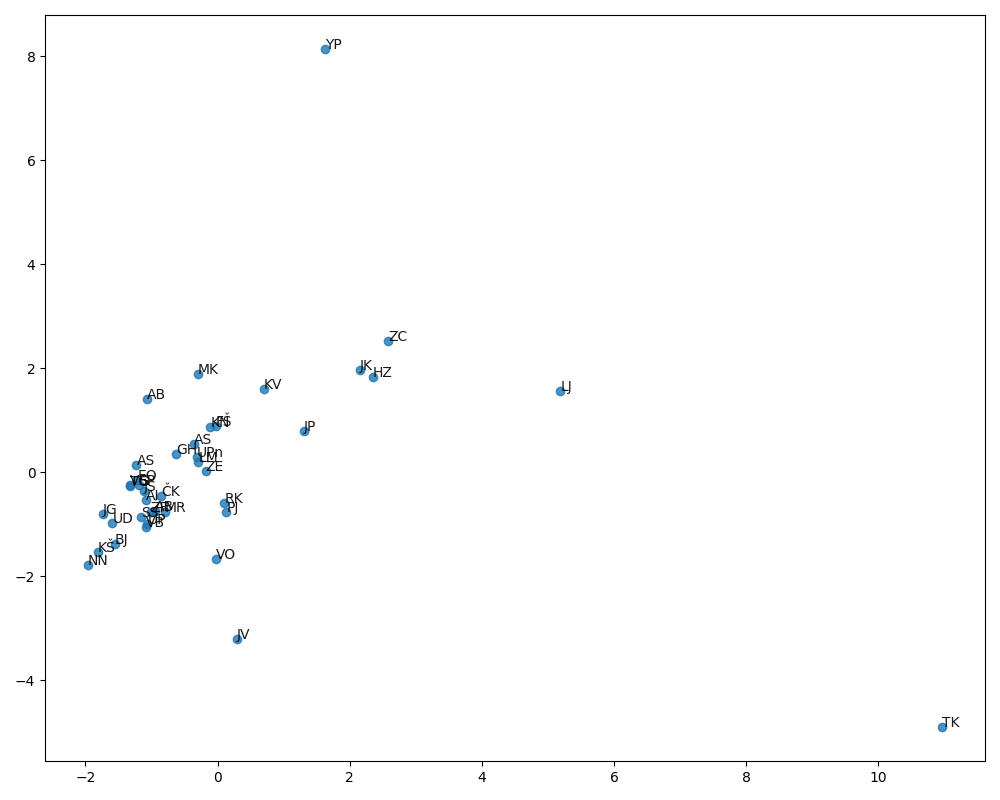

# doc2vec_reports
Finding similar physics lab reports using doc2vec

## Steps

1. Download slovenian wiki (or any other): https://dumps.wikimedia.org/slwiki/20231001/
2. [Extract and parse xml ](/process_wiki_xml.py)
3. [Train doc2vec](train_doc2vec.py) model using [gensim](https://radimrehurek.com/gensim/models/doc2vec.html)
4. [Parse](parse_reports.py) `.pdf` lab reports in `reports/` (file name is `something_first_last.pdf`) using `textract` or `pdfium` and clean the text
5. [Find similar reports](eval_model.py) using doc2vec model
6. Plot cosine similarity matrix between reports

## Results

### Similarity (correlation) matrix

### Similarity scores 

### PCA in 2d
